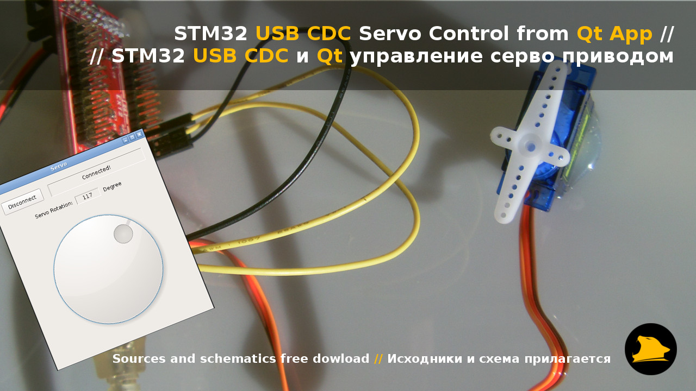

# STM32 USB_CDC Servo Control from Qt App

###How to...
1. Connect modules as shown on "Connection.png"
2. Flash firmware into MCU
3. Run "Qt Project/Linux AMD64 Binary/Servo" and press "Connect" button
4. Servo continiously updates position to selected degree

- USB device detected by Vendor ID and Product ID
- PC Binaries built for Linux AMD64 but you can build it for any other platform with QtCreator

###Project demo Video/Photo
- YouTube demo video URL: https://www.youtube.com/watch?v=Z_zT6ZBXQdI
- Yandex Disk folder URL: https://yadi.sk/d/m7c2OU8C33pRzm
